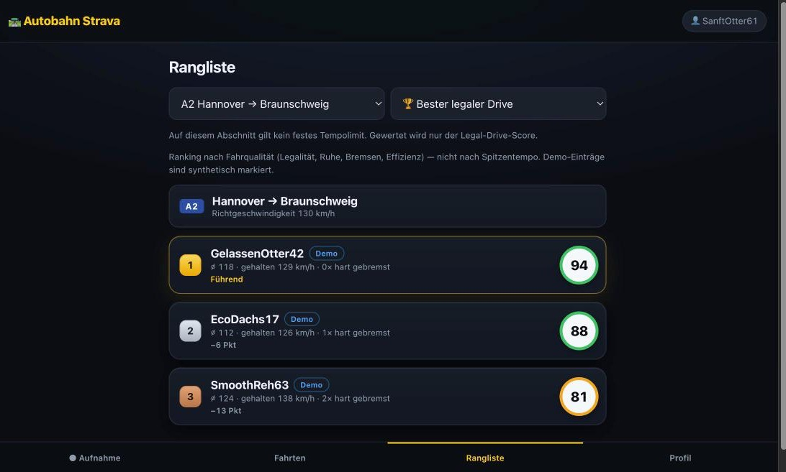

# Autobahn Strava 🛣️

[](https://github.com/gotakt/autobahn-strava/actions/workflows/pruefung.yml)


**Strava for Autobahn journeys — but the winning metric is *best legal drive*, not top speed.**

Record a drive with your phone's GPS, then compare it against other people who drove the
same Autobahn section. Instead of rewarding whoever went fastest, the leaderboard rewards
**lawful, smooth and efficient** driving.

> ⚠️ This is not a racing app. Top-speed ranking on public roads is deliberately **not**
> a feature — see [Safety & the law](#safety--the-law).



<sub>The same-segment leaderboard. The entries marked *Demo* are synthetic, so the board is
not empty on first run. On a stretch without a fixed limit there is no "fastest legal drive"
view at all — only the score.</sub>

---

## What it does (MVP)

- 🔴 **Start / stop trip recording** — GPS position, time, speed, accuracy, sampled continuously.
- 🗺️ **Automatic Autobahn-segment detection** — matches your drive to a known section
  (e.g. *A2 Hannover → Braunschweig*) by start/end position and direction.
- 📈 **Speed graph + trip stats** — distance, duration, average moving speed, and a
  **sustained max** (fastest rolling 5-second average, not a single GPS spike).
- 🏆 **Same-segment leaderboard** ranked by a **Legal-Drive Score**, not by top speed.
- 👤 **Anonymous nicknames** — no real names required.
- 🔒 **Privacy controls** — trips default to private, the first & last 500 m are trimmed
  before anything is measured **on drives long enough for that to work**, the raw GPS path is
  never stored at all, and any trip can be deleted. Local data and published online entries
  can be deleted — local and published, in one action. See [Deleting things](#deleting-things).
- 🌐 **Optional online leaderboard** — off until you switch it on, and then still per trip.
- 🕵️ **GPS-cheating detection** — implausible speeds, teleport jumps and junk-accuracy
  traces are flagged and excluded from ranking.
- 🏁 **Track mode** — a separate mode where top-speed / acceleration are allowed, intended
  for **closed / private tracks only**. Track results never mix with public-road leaderboards.

Recording, scoring and storing a drive happen **client-side in the browser**; local trips
and their metrics live in `localStorage`, so the app works with no setup at all. A
**shared online leaderboard exists** on top of that — opt-in, off by default, and only ever
for a trip you explicitly publish. See [Online leaderboard](#online-leaderboard).

---

## Online leaderboard

> **Status on 09.09.2026: the backend is not switched on, and never has been.**
> The Firebase project `autobahn-strava` exists, but neither Cloud Firestore nor anonymous
> sign-in is enabled in it. Measured against the real project, with the client key that
> ships in `web/js/cloud.js`:
>
> ```
> POST accounts:signUp        →  CONFIGURATION_NOT_FOUND
> GET  documents/entries      →  PERMISSION_DENIED — "Cloud Firestore API has not been
>                                used in project autobahn-strava before or it is disabled."
> ```
>
> `firebase firestore:databases:list` fails the same way: there is not even a database.
> So the shared board has never been live, **zero** entries are stored anywhere, and the
> retention rules below have never had anything to act on. The client already says so
> rather than failing blankly — `CONFIGURATION_NOT_FOUND` is mapped to *„Die
> Online-Rangliste ist serverseitig noch nicht eingerichtet."* Everything in this section
> describes what happens **once the project is switched on**; today it is code, not a
> running service. Switching it on has a binding order —
> [`docs/BACKEND-GO-LIVE.md`](docs/BACKEND-GO-LIVE.md).

The app ships with a shared leaderboard backed by Firebase (Firestore over its REST
endpoints — no SDK). It is **opt-in and off by default.** Nothing leaves the device until
you both

1. switch **Online-Rangliste** on in Settings, **and**
2. press **publish** on one specific trip.

**What is uploaded for a published trip:** nickname, the segment's id and — if the segment
is new to the shared registry — its name, road type, limit and its two endpoints (see
[`PRIVACY.md`](PRIVACY.md) for what those endpoints are); the
derived metrics (score, average and sustained speed, hard-braking count, distance,
duration); the downsampled speed-over-time track (≤ 120 points); a coarse area name; and an
anonymous user id.

**What is never uploaded:** the GPS path. No lat/lon of where you actually drove is sent,
because none is stored in the first place — see [`PRIVACY.md`](PRIVACY.md).

**How long it stays:** a published entry expires after **180 days**. The client writes the
expiry, `firestore.rules` verifies it is roughly 180 days ahead so nobody can grant
themselves longer, and expired entries are filtered out of the board even if the cleanup has
not run yet. The cleanup itself is a Firestore TTL policy, and it is **not configured** —
it cannot be, because the database does not exist yet. See [`PRIVACY.md`](PRIVACY.md).

**Before anything is uploaded** you have to agree to a text saying what is transmitted, for
how long, and how to remove it. The agreement is recorded with a timestamp and a version; if
the text changes materially, you are asked again. Switching the feature off never asks.

**Taking your data with you:** *Settings → Deine Daten → Daten exportieren* writes a JSON
file with everything held about you, including your online entries fetched live.

**Who you are online:** switching the feature on creates an anonymous Firebase identity —
no email, no password, no profile. It is kept in `localStorage` under `as_cloud_session`
and is the only thing linking two of your published drives to each other.

### Deleting things

**One action.** *Alles löschen* removes the local trips, the profile and self-created
routes, **and** every entry this identity ever published, **and** the identity itself, **and**
the recorded consent.

The online part runs first on purpose: if it fails, nothing is deleted and you can try again.
The other way round the identity would be gone — and with it the only way to reach those
entries.

Until 09.09.2026 these were two buttons, and pressing only the local one left the published
entries online and kept the identity.

---

## The Legal-Drive Score

A public-road drive is scored 0–100 from four components — **none of them is "who was fastest".**

| Component | Weight | Rewards |
|---|---|---|
| **Lawfulness** | 40% | Staying at/under the applicable limit; where none applies, staying near the 130 km/h *Richtgeschwindigkeit*. Exceeding a known limit is penalised hard. |
| **Smoothness** | 25% | Low jerk — gentle, steady speed changes rather than surging. |
| **Calm braking** | 20% | Few hard-braking events (strong decelerations). |
| **Efficiency** | 15% | Steady cruising speed, the fuel-friendly band. |

The leaderboard's default sort is **Legal-Drive Score ↓**. "Fastest *legal* journey" is
available as a view, but it only ranks drives that stayed within the limit.

---

## Run it

```bash
npm run serve
# → http://localhost:8123
```

The preview server binds to `127.0.0.1` only, so nothing on your network can reach it. If
you deliberately want it reachable — to open it on a phone in the same WLAN — set
`HOST=0.0.0.0`, and it will say so on startup.

Or just open `web/index.html` in a browser. On a phone, serve it over HTTPS (Geolocation
requires a secure context) — e.g. GitHub Pages or any static host.

**Recording a real drive:** press **Start before you move**, mount the phone in a holder,
and don't touch it while driving. Recording is fully automatic — see below.

---

## Tests

The badge says **103**, and that is the number of test cases — nothing else counted in.

| | | |
|---|---|---|
| `npm test` | 84 | plain Node tests, no services needed |
| `npm run test:regeln` | 19 | `firestore.rules` against the Firestore emulator (needs Java) |
| | **103** | |

The emulator suite lives in `tests/emulator/` rather than beside the others, and that is
deliberate: `npm test` matches `tests/*.test.mjs`, and without a running emulator its
`before()` throws. `node --test` then reports those cases as `cancelled` while printing
`fail 0` — a line that looks green although 19 checks never ran.

**What is *not* in the 103.** There are also **17 sabotage directions** across five scripts
(`npm run test:sabotage`, `:serve`, `:recorder`, `:loeschen`, `test:regeln:sabotage`). Each
one breaks a promise on purpose and requires a **named** test case to go red — an exit code
alone is not accepted, because a typo would produce one too. They are counter-checks on the
tests, not tests, so counting them would inflate the number. Every one of them runs in CI.

A green suite proves nothing until it has been shown that it can go red. That is what the
sabotage scripts are for, and it is why several of the bugs in this repository's history
were found by breaking working code rather than by writing more of it.

---

## Native iOS

The repository contains a Capacitor iOS target (`ios/App/App.xcodeproj`). It exists for one
reason: the browser's geolocation API stops the moment the screen locks or you switch apps,
which is exactly when a drive is being recorded. Inside the native shell a background
watcher keeps recording — **only between an explicit Start and Stop**, which is what the
permission strings in `Info.plist` promise.

```bash
npm ci
npx cap sync ios
open ios/App/App.xcodeproj
```

`npx cap sync ios` copies `web/` into the app bundle and regenerates `Package.swift`. On a
clean checkout it must leave the working tree unchanged — if `git status` shows a diff
afterwards, something committed is out of date.

**The build runs — on one toolchain.** Measured on 09.09.2026:

| | |
|---|---|
| Xcode | 26.6 (17F113) |
| Simulator runtime | iOS 26.5 (23F77), arm64 |
| Deployment target | iOS 15.0 |
| Result | `** BUILD SUCCEEDED **`, 0 errors |
| Product | `App.app`, 5.6 MB, with all 24 web assets in the bundle |
| Installed on | simulator `AutobahnProbe` (`1B6B60A5…`), iOS 26.5 |
| Launched | yes — `de.autobahnstrava.app`, and the UI rendered: the Record tab with the public-road / track switch, the speed readout and the tab bar |

```bash
xcodebuild -project ios/App/App.xcodeproj -scheme App -configuration Debug \
  -sdk iphonesimulator -destination 'generic/platform=iOS Simulator' \
  CODE_SIGNING_ALLOWED=NO build
```

The only warning is `appintentsmetadataprocessor: Metadata extraction skipped. No
AppIntents.framework dependency found.` — expected for an app that uses no App Intents.

**What is still not proven.** The proof reaches as far as: it compiles, installs, starts and
draws its interface on a simulator. It stops there. Nobody has run this build on a physical
iPhone and nobody has driven with it, so none of the following has been observed:

- the location permission dialogs, and what the app does when permission is refused;
- **background location with the screen locked** — the one thing the native shell exists
  for, and the thing `Info.plist` makes a promise about;
- real GPS on real hardware, at real speed.

A simulator has no GPS receiver and no lock-screen power management, so it cannot show any
of that even in principle. That boundary is deliberate and stays documented rather than
quietly implied away.

**A note on the plugin.** `npx cap sync ios` warns that
`@capacitor-community/background-geolocation` is built for Capacitor 7 while this project
uses Capacitor 8. An earlier note here said the warning had stopped appearing. It has not.
Measured on 09.09.2026: after a fresh `npm ci` it appeared on the **first** `cap sync ios`
and then not on the second or third, with an identical `Package.swift` written each time.
So it is run-dependent, not gone — which is exactly why the earlier reading was wrong.

The build produces no related error either way. The package's own metadata asks for
`@capacitor/core >=3.0.0`; the Capacitor-7 figure comes from its devDependency on
`@capacitor/core ^7.0.0`. Recorded as a known, run-dependent observation. **No dependency is
being changed on the strength of it** — an upgrade would need its own slice and its own
proof.

There is no iOS build in CI. A macOS runner plus a platform download, for a repository
without signing certificates, would cost a lot and prove little.

## Safety & the law

This app is designed around German road law and the GDPR:

- **No public-road top-speed contest.** Organising or joining illegal races, and lone
  reckless driving to reach the highest possible speed, are criminal offences
  (§315d StGB). The public-road leaderboard therefore ranks *legal* driving quality only.
- **Even where no limit applies**, drivers must stay in control and adapt to traffic,
  weather, visibility and road conditions; Germany recommends **130 km/h** *Richtgeschwindigkeit*.
- **No phone-in-hand.** Start recording before departure; the app never needs to be touched
  while driving.
- **GPS speed is an estimate**, not a police-grade or legally certified measurement — the
  true speed can change between location updates.
- **Privacy by design (GDPR):** nicknames instead of names, private-by-default trips,
  first/last 500 m trimmed where the drive is long enough, no raw route stored or uploaded at
  all, one-action deletion covering local data and published entries, a consent text before
  anything can be uploaded, a 180-day retention limit, self-service export, no video/dashcam
  recording.

See [`SAFETY.md`](SAFETY.md) and [`PRIVACY.md`](PRIVACY.md) for detail.

---

## Project layout

```
web/
  index.html        app shell (Record / Trips / Leaderboard / Settings)
  css/app.css       styles
  js/
    segments.js     known Autobahn sections + segment detection
    places.js       nearest coarse area name for a segment
    geo.js          GPS recording, haversine, speed & sustained-max maths
    score.js        Legal-Drive Score + hard-braking / smoothness / cheating checks
    store.js        localStorage persistence, privacy trimming, seeded demo ghosts
    cloud.js        optional online leaderboard (Firestore over REST)
    replay.js       ghost replay of your drive against a rival
    app.js          UI wiring
scripts/serve.js    tiny static server for local preview
firestore.rules     rules for the shared leaderboard
ios/, android/      Capacitor shells — see Native iOS above
```

All eight modules under `js/` are loaded by `index.html` and all eight are in use.

## Roadmap

- **Switching the backend on.** Cloud Firestore and anonymous sign-in are disabled in the
  Firebase project, so the online leaderboard is unreachable — see [Online
  leaderboard](#online-leaderboard). This is *not* a matter of flipping two switches: the
  region is irreversible, TTL needs billing, and Firebase's automatic cleanup of anonymous
  accounts would break the 180-day erasure path. The order is binding and written down in
  [`docs/BACKEND-GO-LIVE.md`](docs/BACKEND-GO-LIVE.md).
- **Server-side scoring and cheat validation.** The shared leaderboard exists, but scores
  are computed on the device, so the rules can only check that a value is physically
  possible — not that it is genuine. Treat the board as friendly competition.
- Optional **OBD-II** connection for higher accuracy and anti-fraud.
- Weather / traffic condition tags per trip.
- Vehicle categories.

## License

MIT — see [`LICENSE`](LICENSE).
